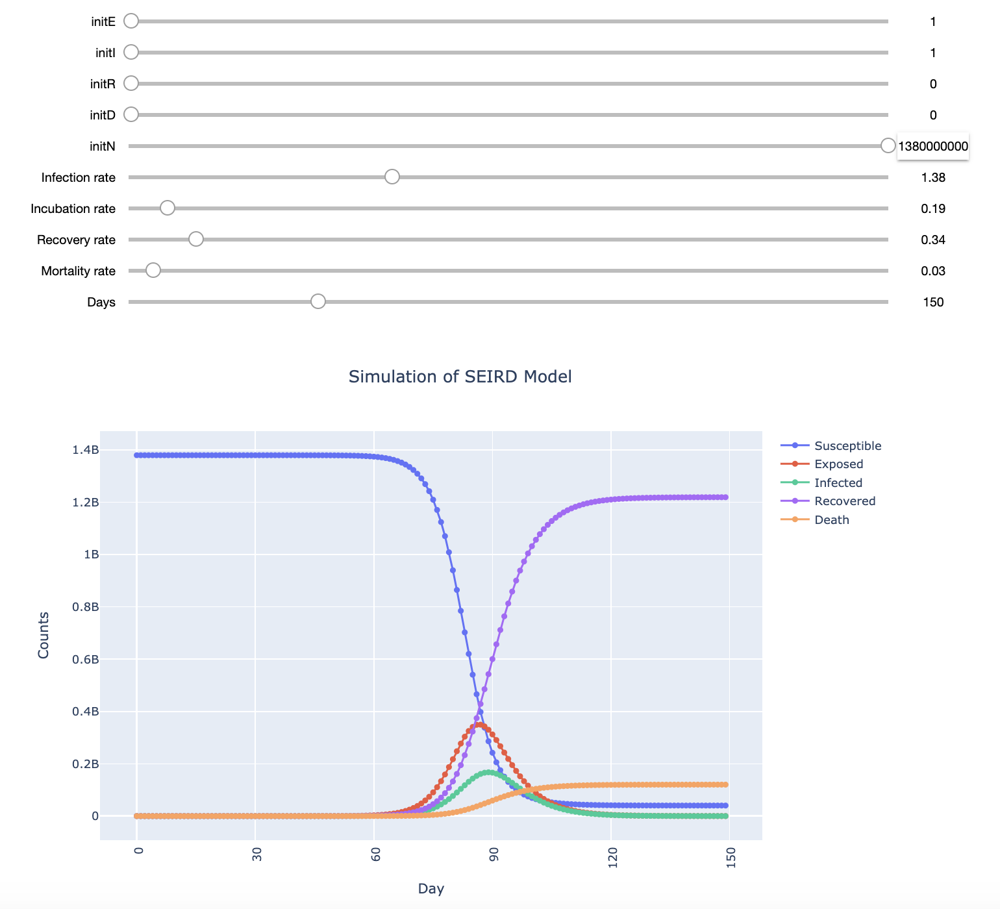

# Simulators for different purposes

The repo currently has the following models implemented in jupyter notebooks:
* [Compartmental models](https://en.wikipedia.org/wiki/Compartmental_models_in_epidemiology "Compartmental models in epidemiology") namely [SEIR](https://github.com/silpara/simulators/blob/master/compartmental_models/SEIR%20Simulator%20in%20Python.ipynb "SEIR Simulator in Python") and [SEIRD](https://github.com/silpara/simulators/blob/master/compartmental_models/SEIRD%20Simulator%20in%20Python.ipynb  "SEIRD Simulator in Python") which are elaborations of the basic SIR model. These models are used in epidemiology to predict the spread of a disease. E.g. variations of these basic models are being used in prediction of spread of COVID-19.

The simulator is built using IPython Widgets. Here is how SEIRD simulator looks like, 

 
The simulator doesn't render in Jupyter notebooks hosted on GitHub but on your local machine, you will be able to run the notebook and use the simulator for various parameter values of choice.
 
## Compartmental Models

### SEIR Model

### SEIRD Model

More details on the models are provided in the corresponding notebooks.

## Organization

**compartmental_models**
- [SEIR](https://github.com/silpara/simulators/blob/master/compartmental_models/SEIR%20Simulator%20in%20Python.ipynb "SEIR Simulator in Python")
- [SEIRD](https://github.com/silpara/simulators/blob/master/compartmental_models/SEIRD%20Simulator%20in%20Python.ipynb  "SEIRD Simulator in Python")

