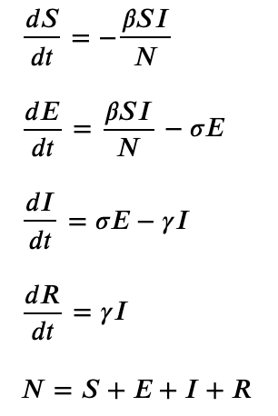
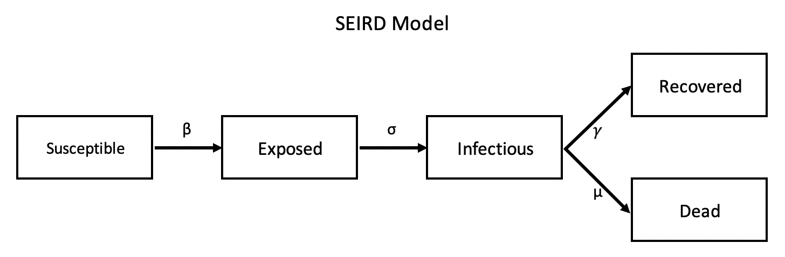
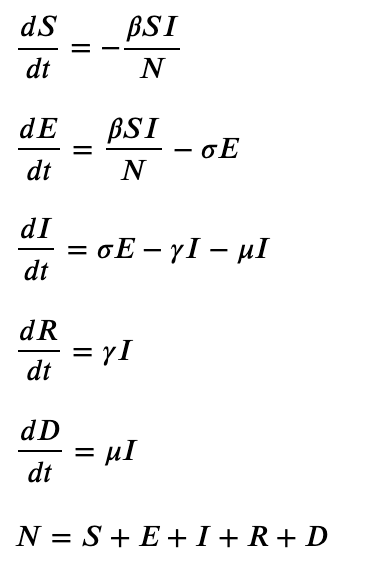
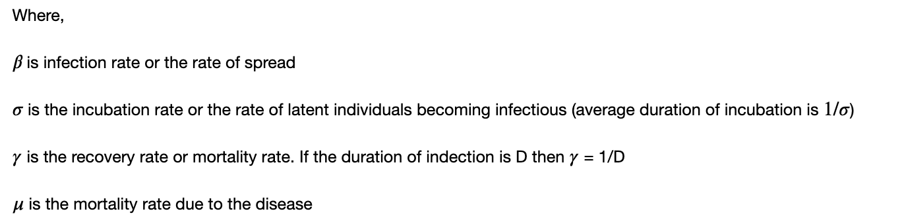

# Simulators for different purposes

The repo currently has the following models implemented in jupyter notebooks:
* [Compartmental models](https://en.wikipedia.org/wiki/Compartmental_models_in_epidemiology "Compartmental models in epidemiology") namely SEIR and SEIRD which are elaborations of the basic SIR model. These models are used in epidemiology to predict the spread of a disease. E.g. variations of these basic models are being used in prediction of spread of COVID-19.

## Compartmental Models

For completeness the models are produced below:

### SEIR Model

### SEIRD Model

## Organization
<code>
compartmental_models
--[SEIR](https://github.com/silpara/simulators/blob/master/compartmental_models/SEIR%20Simulator%20in%20Python.ipynb "SEIR Simulator in Python")
--[SEIRD](https://github.com/silpara/simulators/blob/master/compartmental_models/SEIRD%20Simulator%20in%20Python.ipynb  "SEIRD Simulator in Python")
</code>

